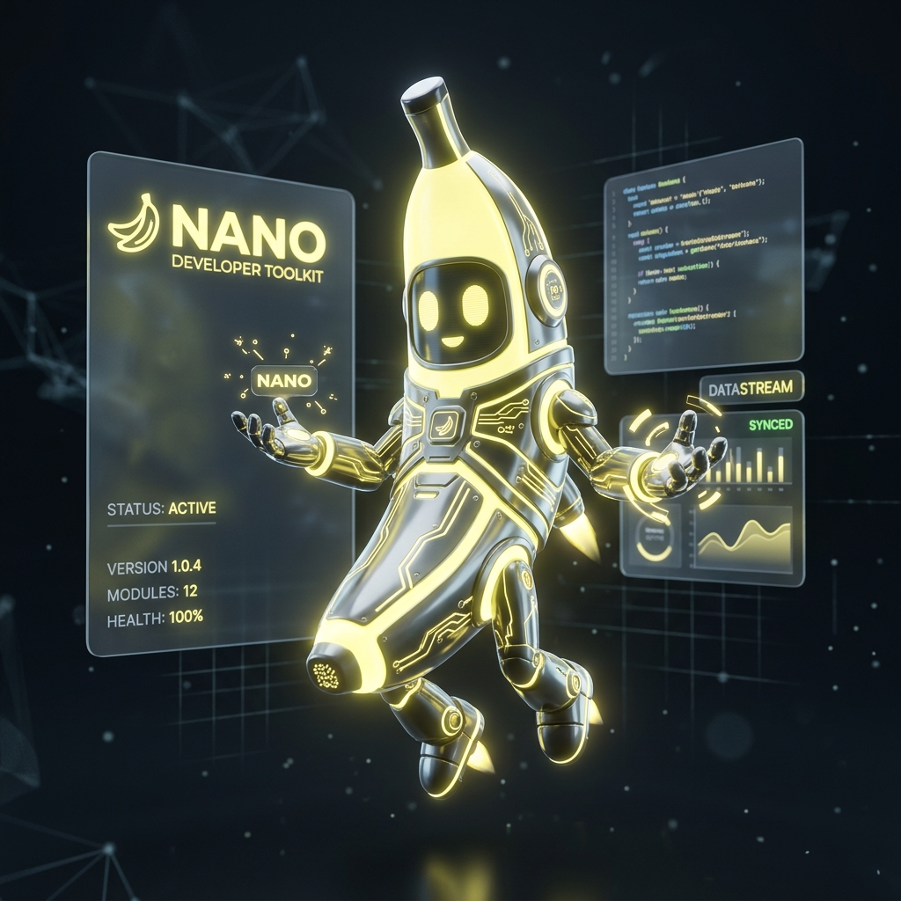

# Manual do Usuário — Lucy

> **O cérebro definitivo para orquestração autônoma, design premium e inteligência competitiva no Cursor Agent.**
> 
> *Versão:* **v2.7.0** · *Mascote:* **Nano Banana** 🍌 · *Autor:* **Thales Calgarotto**

---

<div align="center">
  
  <p><i>"Nós humanos normais usamos 10% das capacidades do nosso cérebro. Imagina se usássemos 100%."</i></p>
</div>

---

## 1. O que é o Lucy?

O **Lucy** transforma o Cursor Agent em um desenvolvedor autônomo de nível máximo, integrando:

- **100% do Cérebro**: Loops de execução autônomos que avançam até 100% de conclusão.
- **Segundo Cérebro**: Lembrança persistente de decisões de projeto, preferências e contexto entre sessões.
- **Inteligência Competitiva**: Ferramentas para analisar o mercado e fechar gaps de funcionalidades automaticamente.
- **Director de Design**: Seleção e roteamento das melhores ferramentas estéticas do ecossistema.

---

## 2. Pré-requisitos

| Requisito | Como verificar |
|-----------|----------------|
| Cursor com **Agent Skills** ON | Settings → Rules → Agent Skills |
| Git + Node.js + jq | `node -v`, `jq --version` |
| Projeto com código ativo | Qualquer repositório Git |

---

## 3. Instalação e Configuração

### 3.1 Clone do Repositório

```bash
git clone https://github.com/tcalgarotto/loop-master.git ~/.cursor/skills/lucy
cd seu-projeto
```

### 3.2 Inicialização Automática

No chat do Cursor Agent, execute o seguinte comando:

```
/lucy init
```

Esse comando realiza os seguintes passos de forma automática:
1. Executa o script de inicialização (`scripts/init.sh`).
2. Configura e inicializa o **Second Brain** local.
3. Inicia o **Quiz de 6 rodadas** para definir o contexto do seu projeto.
4. Gera o plano inicial e as tarefas em fases.

---

## 4. Guia de Comandos

O Lucy vem com um conjunto completo de comandos para cada etapa do ciclo de desenvolvimento:

### 4.1 Orquestração

| Comando | Descrição |
|---------|-----------|
| `/lucy init` | Inicializa o ambiente, instala as dependências e roda o quiz de 6 rodadas. |
| `/lucy` | Executa o próximo "tick" de trabalho autônomo. |
| `/lucy update` | Atualiza a skill para a última versão sem perder o contexto do projeto. |
| `pare o loop` | Interrompe o loop recorrente de execução. |

### 4.2 Análise Competitiva

| Comando | Descrição |
|---------|-----------|
| `/lucy @url` | Analisa a URL de referência, mapeia gaps e cria um plano de implementação. |
| `/lucy --auto @url` | Executa a análise competitiva e a implementação sem pausas para aprovação. |
| `/lucy analise @url` | Realiza apenas o mapeamento de gaps (análise pura, sem alterar código). |
| `/lucy build` | Executa o plano competitivo gerado. |
| `/lucy audit` | Reaudita a fase atual em busca de conformidade e gaps. |
| `/lucy continuar` | Retoma o progresso do pipeline competitivo após reinicialização. |

### 4.3 Qualidade e Entrega

| Comando | Descrição |
|---------|-----------|
| `/lucy test` | Cria e executa testes unitários, de integração e testes E2E (Playwright). |
| `/lucy test --ci` | Executa a suíte de testes de forma silenciosa para integrações CI. |
| `/lucy perf` | Realiza auditoria completa de performance (Core Web Vitals, bundle, N+1 queries). |
| `/lucy perf --fix` | Analisa a performance e aplica otimizações automáticas de baixo risco. |
| `/lucy deploy` | Executa build, pré-validações, deploy real e monitoramento pós-deploy. |
| `/lucy deploy --rollback` | Reverte o último deploy caso o health check pós-deploy falhe. |

### 4.4 Internacionalização (i18n) e Docs

| Comando | Descrição |
|---------|-----------|
| `/lucy i18n` | Escaneia strings fixas, monta arquivos de tradução e configura internacionalização. |
| `/lucy i18n --scan` | Apenas faz o levantamento de strings fixas sem realizar alterações. |
| `/lucy docs` | Gera documentação de APIs, componentes e changelogs. |
| `/lucy docs --adr` | Cria e registra um Architecture Decision Record (ADR) para o projeto. |

---

## 5. Second Brain (Estrutura de Memória)

O Lucy gerencia sua própria persistência de memória em quatro camadas:

1. **L0 (Brain Local)**: `.cursor/loop-master-brain/` — Guarda suas preferências em `dev-profile.json` e decisões arquiteturais em `project-mind.json`.
2. **L1 (Progress)**: `.cursor/loop-master-progress.json` — Handoff do estado atual entre os ticks do loop.
3. **L2 (claude-mem)**: Busca semântica local baseada em banco de dados SQLite.
4. **L3 (Documentação)**: `docs/LOOP-MASTER-PLAN.md` e `docs/LOOP-MASTER-INDEX.md` legíveis por humanos.

---

## 6. O Ecossistema de Skills

Durante o `/lucy init`, a stack padrão é automaticamente instalada:
- **impeccable**: Otimização estática de CSS, tipografia e layout de UI.
- **ui-ux-pro-max**: Design systems padronizados por indústria.
- **taste-skill**: Prevenção de interfaces estilo "template genérico".
- **caveman**: Compressão de texto para economizar até 75% em tokens de entrada.
- **nextjs-premium-stack**: (Auto-detectada) Instala e configura shadcn/ui, framer-motion, Tremor e TanStack Query.

---

## 7. Integração Contínua (CI/CD)

O Lucy pode ser acionada por eventos de Git/CI através do hook em `scripts/ci-hook.sh`:
- PRs abertos ou atualizados disparam auditorias automáticas.
- Notificações de falha no pipeline local despertam o assistente com contexto do erro.

---

## 8. Resolução de Problemas (Troubleshooting)

### Os ganchos (hooks) não estão rodando
1. Verifique se o arquivo `.cursor/hooks.json` foi criado.
2. Certifique-se de que a opção de Agent Skills está ativa em seu editor.
3. Reinicie o Cursor.

### O loop parou de rodar antes de 100%
Execute `/lucy` no chat para forçar a hidratação e rearmar a fila.

---

## Licença

MIT License. Copyright (c) 2026 Thales Calgarotto.
Descubra como desenvolver mais rápido com 100% de capacidade. 🍌
