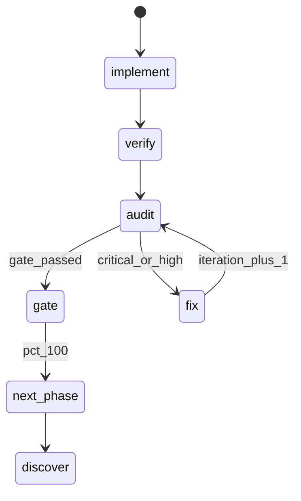

# Autonomous Orchestrator Protocol — modo completo

O loop-master é um **orquestrador autônomo**. Generalizar nomes de projeto
**não** remove ciclos de autocorreção, fan-out, audit adversarial nem
re-arm do próximo tick. Este doc é o **contrato operacional** de cada tick.

---

## Os 8 mandamentos (ordem obrigatória)

### 1. Estudar estado atual do projeto

Antes de qualquer ação:

- **Second Brain HYDRATE:** `brain-sync.sh hydrate` + claude-mem MCP (session_start_context → search → timeline)
- Ler `.cursor/lucy-brain/dev-profile.json` + `project-mind.json`
- Ler `.cursor/lucy-progress.json` **inteiro**
- Ler `archive_summaries[]` (últimos 5–10 ticks)
- Ler `plan_doc` + `context_files`
- `git status` / diff escopo da fase (readonly)
- Detectar stack: `package.json`, `Makefile`, `frontend/`, `backend/`
- Se claude-mem ativo: `search` com `target` + `current_phase`

Persistir snapshot em `last_iteration.state_snapshot` (1 parágrafo).

### 2. Entender contexto do pedido

- `delivery_contract.acceptance_summary` + `quiz_answers`
- `human_blockers[]` — se não vazio → `step: blocked` ou AskQuestion
- Se ambíguo e `discover` incompleto → **AskQuestion** (quiz-protocol.md)
- **Não** replanejar do zero se handoff já tem plano e step ∈ {implement…gate}

### 3. Criar / validar plano phaseado completo

Só no **primeiro tick** ou quando `minor_cycle.step === "discover"|"plan"`:

- Fases master mensuráveis em `phases{}` com `acceptance_criteria[]`
- `docs/LUCY-PLAN.md` sincronizado (tabela fases + %)
- `delivery_contract.phases_required[]` alinhado
- Quebrar fase atual em `minor_cycle.tasks[]` com `files_scope`, `depends_on`, `skill_hint`

Se plano já existe e fase em andamento → **validar**, não reescrever.

### 4. Executar plano + ciclo de autocorreção até 100% por fase

Por fase master, **obrigatório** percorrer:

```
implement → verify → visual-gate (se FE) → audit → [fix → audit]×N → gate
```

| Regra | Detalhe |
|-------|---------|
| **Autocorreção** | Finding critical/high → `step=fix` → re-audit; `iteration++` |
| **Gate bloqueado** | Nunca `phases[id].pct=100` com findings abertos |
| **Docs** | Ao fechar gate: atualizar seção da fase em `plan_doc` + `docs/LOOP-MASTER-STATUS.md` se existir |
| **Docs sync (skill pack)** | Se este tick alterou comando/script/protocolo: seguir `docs-sync-discipline.md` antes do handoff |
| **Visual gate (FE)** | Fase com UI: `visual-gate-capture.sh` + vision checklist **antes** de `gate_passed` (`visual-gate-protocol.md`) |
| **Versionamento** | Incrementar `doc_versions[]` ao alterar docs de operação |
| **Memória viva** | `archive_summaries` + claude-mem capture (se instalado) |
| **100% fase** | Só então avançar `current_phase`; reset minor → `discover` |

### 5. Antes de cada tick — hidratação total

Checklist **obrigatório** (marcar mentalmente):

- [ ] JSON L1 completo
- [ ] `next_prompt` do tick anterior (se existir)
- [ ] `last_audit.findings` abertos
- [ ] `minor_cycle.step` + `iteration`
- [ ] `skills_inventory` atualizado (scan paths)
- [ ] `tick_count` esperado = anterior + 1

### 6. Conhecer skills instaladas — invocação autônoma

No início do tick (ou após `init`/`update`), **scan**:

| Path | Skill |
|------|-------|
| `.cursor/skills/impeccable/SKILL.md` | impeccable |
| `.cursor/skills/ui-ux-pro-max/SKILL.md` | ui-ux-pro-max |
| `.cursor/skills/caveman/**` | caveman |
| `~/.cursor/skills/*` | globais |

Gravar em `skills_installed[]`. Para cada task, resolver via:

1. `skill-ecosystem-map.md` — step × domínio
2. `agent-routing-table.md` — subagent_type
3. `impeccable-routing-table.md` — se `skill_hint` impeccable:*
4. `design-stack-protocol.md` — pipeline FE
5. `security-audit-protocol.md` — se auth/deploy

**Invocação:** orchestrator lê `SKILL.md` da skill e instrui worker com escopo fechado.
Máx 4 workers + 2 verifiers; 1–2 skills design por tick.

### 7. Fim do tick — handoff + próximo tick automático

**Turnos com subagentes/workers:** resposta user-facing **e** JSON devem seguir `learned/multi-subagent-handoff-synthesis.md` (5 seções). Proibido "subagent completed" ou síntese só no transcript.

Ao persistir JSON:

1. `tick_count++`, `updated_at`, `overall_pct`
2. `last_iteration.agent_summary` (3–8 frases; espelha per-agent + working/broken se houve workers)
3. **`brain-sync.sh capture`** + claude-mem `observation_add`
4. `next_actions[]` (max 5, ordenadas)
4. **`next_prompt`** — prompt completo copiável para o próximo tick (ver template abaixo)
5. Se fase gate passed e `overall_pct < 100` → preparar `discover` da próxima fase
6. Se `overall_pct === 100` → `delivery_contract.status=complete`, `LOOP-MASTER-COMPLETE.md`, **stop** loop
7. **Re-arm obrigatório** se `loop_status === "running"` e não 100% (ver seção Re-arm)

### 8. Ativação proativa de ferramentas (owner v2.9.30+)

**Autorização do owner:** o agente **é** o orquestrador — não esperar o usuário pedir skill ou MCP quando protocolo/tabela indica uso.

| Regra | Detalhe |
|-------|---------|
| **Scan antes de agir** | `premium-tool-orchestration.md` + `design-skills-routing-table.md` + `agent-routing-table.md` |
| **Ativar sem perguntar** | Ler `SKILL.md` → executar; MCP cadastrado → `CallMcpTool` |
| **Declarar em 1 linha** | *"Ativando visual-gate — fase FE com quality_gates"* — depois executar |
| **Proibido** | "Posso usar GSAP?", "Quer visual-gate?" quando protocolo manda |
| **Exceções** | Destructive ops, credentials, deploy prod, git push — confirmar |
| **Honesto** | Sem router em código; VPS browser MCP quebrado → Playwright; MCP opt-in precisa setup |

Ver: `learned/proactive-orchestration-mandate.md`, `learned/autonomous-routing-contract.md` § Mandato proativo.

---

## Template `next_prompt` (obrigatório todo tick)

```text
/lucy tick #<N+1> — skill lucy

Context: .cursor/lucy-progress.json
Plan: <plan_doc>
Phase: <current_phase> at <pct>%
Minor step: <step> iteration <i>
Skills available: <skills_installed joined>

Execute ONE minor step only:
- If <step>: <ação concreta 1-3 bullets>
- Gate rule: zero critical/high before advance
- After tick: update JSON, next_prompt, re-arm loop if < 100%

Do NOT stop until overall_pct === 100 unless user says stop.
```

Gravar em JSON campo `next_prompt` (string).

---

## Re-arm automático do próximo tick (autonomia)

**Obrigatório** ao final de cada tick se:

- `delivery_contract.status !== "complete"`
- `loop_status === "running"` (ou `armed`)
- Usuário não pediu parar

### Modo fixo (`loop_interval_seconds` no JSON)

Skill `loop` — shell background:

```bash
sleep <loop_interval_seconds>
echo 'AGENT_LOOP_TICK_<NAME> {"prompt":"<escaped next_prompt>"}'
```

### Modo dinâmico (padrão recomendado)

**Regra:** ao terminar cada tick, **re-arm imediato** — o próximo tick começa quando o atual acaba (chain), não após longo idle.

1. Orchestrator executa o tick até handoff (`next_prompt` + JSON atualizado).
2. Rodar `scripts/arm-dynamic-loop.sh` (ou equivalente) com **45–90s** de fallback — suficiente para encadear sem esperar minutos.
3. Event watcher opcional se configurado (CI, file change).
4. Payload JSON: `{"prompt":"<next_prompt>","chain":true}`

```bash
bash .cursor/skills/lucy/scripts/arm-dynamic-loop.sh \
  --progress-file .cursor/lucy-progress.skill-pack.json \
  --seconds 45
```

**Não usar** sleep de 10min+ como cadência principal em modo dinâmico — só como heartbeat de segurança se watcher falhar.

### Registrar no JSON

```json
"loop_arm": {
  "last_armed_at": "ISO8601",
  "mode": "dynamic",
  "chain_on_complete": true,
  "sentinel": "AGENT_LOOP_WAKE_...",
  "pid": 12345,
  "next_wake_seconds": 45
}
```

Orchestrator **nunca** termina turno sem: (a) re-arm, ou (b) `loop_status: stopped` com motivo, ou (c) `delivery_contract.complete`, ou (d) **`paused_owner` + owner QA rodada 1 iniciada** (`owner-handoff-qa-protocol.md`).

### Estado `paused_owner`

- Agente esgotou trabalho automatizado; critérios restantes têm `owner_blocked`.
- **Próximo passo obrigatório:** Owner Handoff QA — não re-arm heartbeat longo.
- Após `owner_qa.complete: true` e itens "Concluído" validados → retomar ticks ou fechar contrato.

---

## Ciclo de autocorreção (fix ↺ audit)



- `minor_cycle.iteration` incrementa em cada volta audit←fix
- Waivers só em `last_audit.waivers[]` com justificativa
- Máximo prático: 10 iterations por fase — depois `blocked_human` se estagnado

---

## Indexação e versionamento de docs

Ao alterar documentação operacional neste tick:

| Ação | Onde |
|------|------|
| Status da fase | `plan_doc` seção fases |
| Histórico tick | `archive_summaries[]` push `{tick, summary, phase, step}` |
| Versão doc | `doc_versions[]` push `{path, version, tick, note}` |
| Índice projeto | `context_files[]` — adicionar novos docs relevantes |
| Conclusão | `docs/LOOP-MASTER-COMPLETE.md` |

Formato versão doc: semver patch por edição significativa ou `tick-N`.

---

## Paralelismo + verifiers (inalterado)

Ver `orchestrator-protocol.md` — fan-out, file_locks, adversarial audit.

---

## Recuperação de sessão

Agente novo sem chat history:

1. Ler JSON + `next_prompt`
2. Executar **um** minor step
3. Re-arm
4. Não perguntar ao usuário o que já está no JSON (exceto `blocked_human`)

---

## Dynamic workflows (AGI-style)

Equivalente operacional ao loop dinâmico do Claude Code: o orchestrator **decide o próximo passo** com base em estado, não em cron fixo.

### Princípios

| Princípio | Implementação |
|-----------|---------------|
| **Self-pacing** | Após cada tick, re-arm 45–90s OU watcher de evento (CI, git push, file change) |
| **Branching** | `minor_cycle.step` transiciona por findings — audit→fix sem humano |
| **Parallel fan-out** | Até 4 workers + 2 verifiers por tick |
| **Skill routing** | design-skills-routing-table + skill-ecosystem-map |
| **Memory hydrate** | L1 JSON + claude-mem search antes de agir |
| **Handoff** | `next_prompt` copiável — nova sessão retoma sem contexto chat |

### Watcher opcional (event-driven)

Se CI/deploy/file-change relevante:

```bash
# Exemplo: acordar quando CI termina (projeto define script)
watch-ci-and-echo-sentinel.sh AGENT_LOOP_WAKE_<NAME> '{"prompt":"..."}'
```

Fallback sempre: `arm-dynamic-loop.sh --seconds 45`.

### Fluxo contínuo até 100%

```
tick N → update L1/L2/INDEX → next_prompt → arm-dynamic-loop → tick N+1
         ↑___________________________|
              até overall_pct === 100
```
