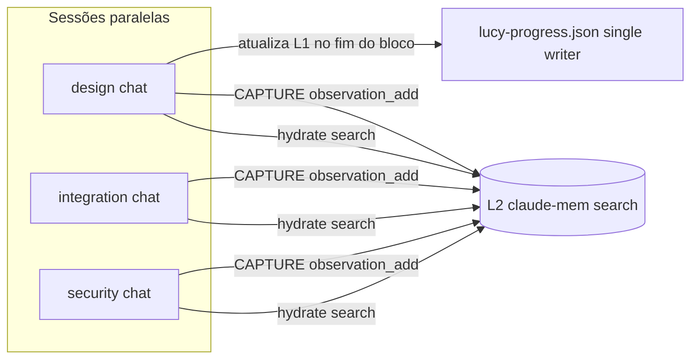

# claude-mem L2 — NVIDIA build.nvidia.com (OpenRouter-compatible)

**Origem:** `/lucy aprenda` — 2026-07-03  
**Versão Lucy:** v2.9.15+  
**Papel:** configurar memória semântica L2 com **NVIDIA NIM** (`build.nvidia.com`) em vez de DeepSeek ou Claude pago.

> Complementa: `second-brain-protocol.md` · `memory-protocol.md` · `mcp-integrations-setup-guide.md`

---

## Quando usar cada camada

| Camada | Storage | Compensa quando… | Não substitui… |
|--------|---------|------------------|----------------|
| **L0 Brain** | `.cursor/lucy-brain/` | Precisa de regras P0, perfil dev, ADRs compactos | Handoff de tick (`next_prompt`) |
| **L1 Handoff** | `lucy-progress.json` | Próximo agente/tick precisa continuar **exatamente** de onde parou | Busca semântica histórica |
| **L2 claude-mem** | SQLite + Chroma (`~/.claude-mem/`) | Sessões paralelas precisam **lembrar** decisões/findings sem reler JSON inteiro | Escrita concorrente em L1 |
| **L3 Human** | PLAN + INDEX + brain/INDEX.md | Owner quer legibilidade e status visual | Worker ou MCP |

**L2 vale a pena** quando você roda **2+ chats Cursor** no mesmo projeto/máquina (design + integração + security) e quer recall semântico (“o que decidimos sobre auth?”) sem duplicar contexto no L1.

**L2 não é obrigatório** — L0 + L1 bastam para a maioria dos projetos (padrão desde v2.9.14).

---

## Multi-sessão paralela — sem corromper arquivos

Três sessões simultâneas (design, integração, security) são seguras **se cada uma respeitar single-writer por artefato**.

### Mapa de concorrência

| Artefato | Sessões paralelas | Regra |
|----------|-------------------|-------|
| `.cursor/lucy-brain/rules/*.md` | ❌ Uma por vez | Append só via `/lucy regra` — nunca editar manualmente em 3 chats |
| `.cursor/lucy-progress.json` (L1) | ❌ **Single writer** | Uma sessão “orquestradora” atualiza; demais **só leem** |
| `.cursor/lucy-brain/STATE.json`, `dev-profile.json` | ⚠️ Append-only | `brain-sync capture` serializa por turno — evitar 3 captures simultâneos no mesmo segundo |
| `preview/*.html`, `references/` (git) | ✅ Paralelo | **Arquivos diferentes** por sessão (`preview/hubfu-design.html` vs `preview/hubfu-security.html`) |
| `src/**` (código) | ⚠️ Coordenar | Mesmo arquivo = conflito git; dividir por módulo/rota |
| **L2 claude-mem** | ✅ Paralelo (leitura) | Índice compartilhado na **mesma máquina**; `search` + `observation_add` de várias sessões |
| `docs/LUCY-INDEX.md` | ❌ Uma por vez | Só sessão orquestradora ou fim de tick |

### Handoff entre sessões — `next_prompt` com rótulo

A sessão que **escreve** L1 deve prefixar o handoff:

```text
/lucy tick #12 — [design] Hero aprovado; pendente carousel integrações.
Outras sessões: [integration] webhook PagSeguro; [security] audit RLS Supabase.
Single writer L1: esta sessão [design] até CAPTURE; depois [integration] assume.
```

| Rótulo | Escopo típico | Arquivos seguros |
|--------|---------------|------------------|
| `[design]` | HTML preview, tokens, motion | `preview/`, `theme-tokens.css` |
| `[integration]` | APIs, webhooks, MCP | `src/app/api/`, `lib/integrations/` |
| `[security]` | Auth, RLS, secrets audit | `middleware.ts`, `docs/security/` |

### Fluxo recomendado



1. **HYDRATE** em cada sessão: L0 + L1 read-only + L2 `search`.
2. Trabalhar em **arquivos distintos** por concern.
3. **CAPTURE** L0 + L2 `observation_add` em cada sessão (append-only no índice L2).
4. **Uma** sessão atualiza L1 `next_prompt` ao fechar bloco de trabalho.

---

## Setup NVIDIA — passo a passo

**Caminho zero-config (v2.9.32+):** ver `references/learned/claude-mem-zero-config-playbook.md` — 3 passos owner + `claude-mem-bootstrap.sh`.

### Atalho — bootstrap idempotente

```bash
# 1. Colar nvapi- em ~/.claude-mem/.env (uma vez por máquina)
# 2. LUCY_CLAUDE_MEM=1 no .env do projeto
LUCY_CLAUDE_MEM=1 bash .cursor/skills/lucy/scripts/claude-mem-bootstrap.sh
# ou init incremental (chama bootstrap automaticamente):
LUCY_CLAUDE_MEM=1 bash .cursor/skills/lucy/scripts/init.sh --update-mode incremental
```

O script: copia `settings.json` + template `.env`, sincroniza **ambas** vars NVIDIA a partir de uma key existente, inicia worker, roda `doctor`.

### 1. Obter API key (build.nvidia.com) — uma por usuário

> **Segurança (v2.9.33+):** `references/learned/nvidia-api-keys-per-user.md` · `references/credentials-policy.md`

1. Acesse [build.nvidia.com](https://build.nvidia.com)
2. Crie conta / faça login
3. **Profile → API Keys → Generate Personal Key**
4. Cole a key (`nvapi-...`) **localmente** em `~/.claude-mem/.env` — agente **guia** estes passos; **nunca** pede a key no chat; **nunca** commitar no repo

Modelos recomendados para extração de observações (baratos/rápidos no NIM):

| Model ID | Notas |
|----------|-------|
| **`meta/llama-3.3-70b-instruct`** | **Default v2.9.28+** — melhor equilíbrio qualidade/latência/custo para indexação L2 |
| `mistralai/mistral-small-24b-instruct-2501` | Mais leve, VPS com RAM limitada (~11 GB) |
| `nvidia/llama-3.1-nemotron-70b-instruct` | Reasoning; mais lento — reservar para tarefas pontuais, não indexação contínua |
| `nvidia/nemotron-4-340b-instruct` | Reasoning pesado; evitar em worker 24/7 |

Consulte modelos ativos em build.nvidia.com — IDs mudam; o valor vai **verbatim** em `CLAUDE_MEM_OPENROUTER_MODEL`.

### Verificar stack completa (agente)

```bash
npx claude-mem status                                    # worker :37700
test -f ~/.claude-mem/.env && echo "nvidia env present"  # nvapi- fora do repo
# MCP: search(query="projeto") → índice com IDs
```

Ver playbook operacional: `references/learned/claude-mem-mcp-operational-playbook.md`.

### 2. `~/.claude-mem/settings.json`

O provider **openrouter** do claude-mem é um client OpenAI-compatible. Aponte para NVIDIA NIM:

```json
{
  "CLAUDE_MEM_RUNTIME": "worker",
  "CLAUDE_MEM_PROVIDER": "openrouter",
  "CLAUDE_MEM_OPENROUTER_BASE_URL": "https://integrate.api.nvidia.com/v1",
  "CLAUDE_MEM_OPENROUTER_MODEL": "meta/llama-3.3-70b-instruct"
}
```

Template no skill pack: `references/templates/claude-mem-settings.nvidia.json`

**Não** coloque a API key em `settings.json` se o arquivo puder ser backupado em texto claro — prefira `.env`.

### 3. `~/.claude-mem/.env` (secrets)

```bash
# chmod 600 ~/.claude-mem/.env
CLAUDE_MEM_OPENROUTER_API_KEY=nvapi-SUA_KEY_AQUI
OPENROUTER_API_KEY=nvapi-SUA_KEY_AQUI   # obrigatório — worker só ativa OpenRouter/NIM com esta var
```

Defina **as duas** com o mesmo `nvapi-…`. Só `CLAUDE_MEM_OPENROUTER_API_KEY` faz o worker cair no Claude SDK (falha em VPS sem `claude` CLI).

Template: `references/templates/claude-mem-nvidia.env.example`

### 4. Habilitar L2 na Lucy

```bash
# Uma linha no .env do projeto (não é secret):
LUCY_CLAUDE_MEM=1

# Bootstrap (recomendado) ou init incremental:
LUCY_CLAUDE_MEM=1 bash .cursor/skills/lucy/scripts/claude-mem-bootstrap.sh
# LUCY_CLAUDE_MEM=1 bash .cursor/skills/lucy/scripts/init.sh --update-mode incremental
```

Verificar:

```bash
npx claude-mem status    # Worker is running
npx claude-mem doctor    # Provider + deps OK
```

### 5. MCP claude-mem no Cursor

1. **Cursor → Settings → Tools & MCPs**
2. Habilitar plugin **claude-mem** (ou MCP search)
3. Reiniciar Cursor se necessário
4. Teste no chat Agent: pedir ao agente `claude-mem search` com query do projeto

Sem MCP cadastrado: L2 worker roda mas o **agente Cursor não consulta** — configure o plugin.

### 6. `/lucy update` (incremental)

```bash
LUCY_CLAUDE_MEM=1 bash .cursor/skills/lucy/scripts/init.sh --update-mode incremental
```

Não reinstala o que já está OK (`install-idempotent.sh`).

---

## Troubleshooting

| Sintoma | Causa provável | Ação |
|---------|----------------|------|
| `OpenRouter API key not configured` | `.env` ausente ou vazio | Criar `~/.claude-mem/.env` com ambas as vars `nvapi-` |
| Worker running, logs `Claude executable not found` | Só `CLAUDE_MEM_OPENROUTER_API_KEY` no `.env` | Adicionar `OPENROUTER_API_KEY=` (mesmo valor) + `npx claude-mem restart` |
| Worker running, agente não busca L2 | MCP desligado no Cursor | Settings → Tools & MCPs → claude-mem ON |
| `Dependencies: degraded` (VPS) | Claude CLI não necessário para NVIDIA | Ignorar se provider=openrouter + doctor OK para embeddings |
| Observações não indexam | Model ID inválido no NIM | Conferir ID em build.nvidia.com |
| RAM alta no VPS | Chroma + SQLite | ~500KB–50MB típico; opt-in só; `npx claude-mem stop` para desligar |
| L1 corrompido / JSON inválido | 3 chats editando `lucy-progress.json` | Restaurar git; adotar single-writer + rótulos `[design]` etc. |
| Quer desligar L2 | Opt-out | `npx claude-mem stop`; `unset LUCY_CLAUDE_MEM`; opcional `rm -rf ~/.claude-mem` |

Reiniciar worker após mudar settings:

```bash
npx claude-mem stop
npx claude-mem start
npx claude-mem status
```

---

## C62 (dev local) vs VPS (Contabo / Hermes)

| Aspecto | C62 (local) | VPS (`ssh contabo`) |
|---------|-------------|---------------------|
| Path Hermes | N/A | `/opt/hermes-crm` |
| Skill pack Lucy | `~/Projetos/Loop-master` ou `~/.cursor/skills/lucy` | `/root/.cursor/skills/lucy` (symlink no Hermes) |
| claude-mem data | `~/.claude-mem/` | `/root/.claude-mem/` |
| RAM | Desktop — Chroma OK | 11 GB — opt-in; monitorar `free -h` |
| L2 compartilhado entre sessões | Mesma máquina = mesmo índice | Idem no VPS; **não** sincroniza C62↔VPS |
| Git pull docs | `git pull` no Loop-master | `cd /root/.cursor/skills/lucy && git pull` |

**Paridade:** mesmos `settings.json` + `.env` em cada host; keys podem ser iguais ou separadas por ambiente.

Aplicar no VPS após push:

```bash
ssh contabo
cd /root/.cursor/skills/lucy && git pull origin main
LUCY_CLAUDE_MEM=1 bash scripts/init.sh --update-mode incremental
# Editar /root/.claude-mem/.env com nvapi-... se ainda não existir
npx claude-mem stop && npx claude-mem start
```

---

## Anti-padrões

- API key NVIDIA no repo, `lucy-progress.json` ou commit
- Três sessões editando L1 ao mesmo tempo
- Assumir L2 sincroniza entre C62 e VPS (são índices locais)
- Instalar worker sem opt-in (`LUCY_CLAUDE_MEM=1`)
- Usar DeepSeek URL misturada com key NVIDIA — base URL deve ser `integrate.api.nvidia.com/v1`

---

## Comandos rápidos

| Comando | Ação |
|---------|------|
| `LUCY_CLAUDE_MEM=1 bash scripts/claude-mem-bootstrap.sh` | **Zero-config** — settings + .env + worker + verify |
| `LUCY_CLAUDE_MEM=1 bash scripts/init.sh` | Instalar/start worker (+ bootstrap automático) |
| `npx claude-mem status` | Health worker |
| `npx claude-mem doctor` | Diagnóstico provider |
| `bash scripts/mcp-setup-guide.sh --slug claude-mem` | Guia resumido |
| `bash scripts/mcp-setup-status.sh --json` | Status integrações |
