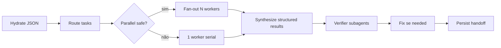

# Orchestrator protocol — estilo Claude Dynamic Workflows

Modelo espelhado do [Claude Code Workflows](https://code.claude.com/docs/en/workflows):

| Papel | Quem | Contexto | Decide o quê |
|-------|------|----------|--------------|
| **Orchestrator** | Agente pai (este tick) | JSON + plano mestre | Próximo passo, quem spawnar, merge de resultados |
| **Worker** | Subagent via `Task` | Janela isolada | Uma unidade de trabalho com output estruturado |
| **Verifier** | Subagent readonly | Janela isolada | Ataca achados do worker (adversarial) |
| **State** | `.cursor/loop-master-progress.json` | Fora do chat | Plano, locks, runs paralelos, findings |

Subagents **não conversam entre si**. Só o orchestrator vê tudo.

## Fases do workflow (por tick)



| Fase interna | `minor_cycle.step` | Subagents típicos |
|--------------|-------------------|-------------------|
| Descobrir | `discover` | AskQuestion, `explore`, claude-mem |
| Planejar | `plan` | orchestrator, ui-ux-pro-max, impeccable shape |
| Executar | `implement` / `execute` | `generalPurpose`, `shell`, design skills |
| Verificar | `verify` | `shell` smoke, impeccable detect |
| Auditar | `audit` | `security-review`, `bugbot`, impeccable critique |
| Corrigir | `fix` | `generalPurpose` serial por arquivo |
| Gate | `gate` | orchestrator + `shell` + impeccable polish |

## Quando paralelizar (fan-out)

Paralelize **no mesmo tick** quando **todas** forem verdadeiras:

1. Tarefas em `minor_cycle.tasks` com `status: pending` e **sem dependência** entre si.
2. **Zero overlap** em `files_scope` / `file_locks` (ver abaixo).
3. Mesmo `minor_cycle.step` (`execute` ou `audit` readonly).
4. Máximo **4 workers** simultâneos por tick (prático no Cursor; Claude usa até 16).

### Sinais para fan-out (como Claude ultracode)

| Padrão | Exemplo | Ação |
|--------|---------|------|
| Por diretório | `backend/api` + `frontend/dashboard` | 2 workers |
| Por domínio readonly | security + bugbot no mesmo diff | 2 verifiers paralelos |
| Por endpoint | auditar 10 rotas independentes | N workers (batch de 4) |
| Por fase master | S6 backend + S7 UI sem overlap | **Não** — fases master são serial |

## Detecção de conflito (obrigatório antes de spawn)

Uma tarefa **não pode** rodar em paralelo se:

| Conflito | Regra |
|----------|--------|
| **Mesmo arquivo** | `files_scope` intersecta com outra task `in_progress` ou lock ativo |
| **Mesmo módulo crítico** | ex. `backend/app/core/security.py` — serializar sempre |
| **Write + read same path** | execute em `X` enquanto audit lê `X` → serial |
| **Dependência** | task B tem `depends_on: ["t1"]` e t1 não está `done` |
| **Mesmo recurso externo** | migration DB, deploy, porta 8000 — 1 `shell` por vez |
| **Interesse oposto** | implementer vs verifier no **mesmo** escopo no mesmo step → verifier **depois** do merge |

### File locks no JSON

Ao iniciar worker, orchestrator registra:

```json
"file_locks": [
  { "path": "backend/app/routers/billing.py", "holder": "t3", "mode": "write", "until": "2026-06-30T12:00:00Z" }
]
```

Liberar lock quando task → `done` ou `failed`. Próximo tick ignora locks expirados.

## Output estruturado de cada subagent

Exigir no prompt do worker (orchestrator cola isto):

```text
Return ONLY this JSON block at the end:
{
  "task_id": "t3",
  "status": "done|blocked|failed",
  "files_touched": ["path/a.py"],
  "summary": "2-5 sentences",
  "findings": [],
  "tests_run": [{ "command": "...", "result": "pass|fail" }],
  "blockers": []
}
```

Orchestrator **não** cola transcript inteiro no JSON — só o struct acima.

## Loop adversarial (audit)

Como Claude workflows (verify independente):

1. Worker(s) terminam → orchestrator merge em `parallel_runs.results`.
2. Spawn **verifiers readonly** em paralelo se escopos diferentes:
   - `security-review` — diff em auth/tenant/integrations
   - `bugbot` — diff geral de lógica
   - `ci-investigator` — se CI vermelho
3. Findings entram em `last_audit.findings` com `source_agent`.
4. Se critical/high → `minor_cycle.step = fix`; workers de fix **serial** por arquivo.

## Árvore de decisão (qual primitivo usar)

| Situação | Primitivo |
|----------|-----------|
| 1 tarefa, 1 arquivo | Orchestrator ou 1 `generalPurpose` |
| 2+ tarefas independentes, paths distintos | Fan-out paralelo `Task` |
| Entender código antes de editar | `explore` readonly → depois execute |
| Review sem editar | `bugbot` / `security-review` readonly |
| Comando/teste | `shell` |
| Design antes de implementar | `ai-architect` readonly → execute |
| CI quebrado | `ci-investigator` |
| Deploy/perf | `deployment-expert` / `performance-optimizer` |

**Agent Teams** (peers que conversam): **não** usamos no loop-master — preferir orchestrator + workers isolados (menos drift, estado no JSON).

## Limites e custo

- Máx 4 workers + 2 verifiers por tick salvo pedido explícito do usuário.
- Readonly para audit/review sempre que possível.
- `run_in_background: true` só se usuário em Multitask Mode; senão paralelo síncrono na mesma mensagem (vários `Task` num turno).
- Orchestrator sintetiza 1 parágrafo para o usuário; detalhes ficam no JSON.

## Recuperação

- Worker `failed` → task volta `pending`, nota em `blockers`.
- Conflito detectado tarde → reverter task para `pending`, próximo tick serial.
- Session nova → só JSON + `plan_doc` necessários (como resume de workflow Claude).
