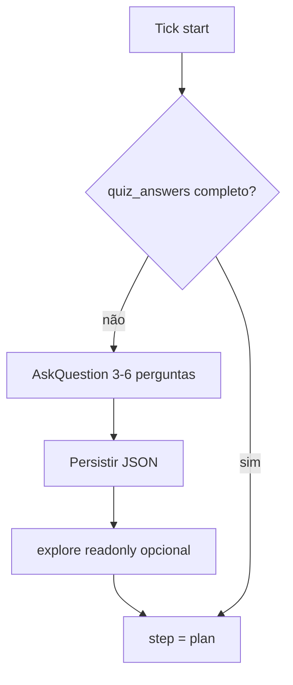

# Quiz Protocol — AskQuestion no loop-master

O orchestrator usa a ferramenta **AskQuestion** do Cursor para fechar contexto
**antes** de implementar — equivalente ao "quiz ao vivo" que o usuário descreveu.

## Quando disparar quiz

| Situação | Obrigatório? |
|----------|--------------|
| `/loop-master init` | Sim — mínimo 3 perguntas |
| `minor_cycle.step === "discover"` | Sim, se `quiz_answers` incompleto |
| `minor_cycle.step === "plan"` e critérios vagos | Sim — 1–3 perguntas focadas |
| Ambiguidade de escopo (FE vs BE) | Sim |
| Gate bloqueado por decisão de produto | Sim — 1 pergunta |
| Execute/audit/fix com escopo claro no JSON | Não |
| Tick recorrente com handoff completo | Não |

## Regras

1. **Preferir AskQuestion** sobre texto livre quando há opções discretas.
2. Máximo **6 perguntas por turno** — não fatigar o usuário.
3. Sempre incluir **"Other"** implícito (AskQuestion suporta) para texto custom.
4. Persistir respostas em `quiz_answers` e referenciar em `minor_cycle.tasks[].notes`.
5. Se usuário não responder (timeout/blocked): `minor_cycle.step = "blocked"`, `human_blockers[]`.

## Banco de perguntas por domínio

### Produto / escopo

```yaml
id: scope_surface
prompt: "Qual superfície esta fase deve entregar?"
options:
  - id: api_only
    label: "Só API/backend"
  - id: ui_only
    label: "Só frontend/UI"
  - id: full_e2e
    label: "Full-stack E2E (API + UI)"
  - id: docs_ops
    label: "Documentação / runbook"
```

### Design

```yaml
id: design_register
prompt: "Register visual para esta entrega?"
options:
  - id: product_restrained
    label: "Product app — restrained, dense, operational (Recommended)"
  - id: marketing_brand
    label: "Marketing / landing — mais expressivo"
  - id: inherit
    label: "Seguir DESIGN.md existente sem mudanças"
```

### Qualidade / gate

```yaml
id: gate_strictness
prompt: "Gate desta fase — o que bloqueia avanço?"
options:
  - id: strict
    label: "100% critérios + zero critical/high (Recommended)"
  - id: waivable_medium
    label: "Permite medium com waiver documentado"
  - id: mvp
    label: "MVP — só happy path + testes core"
```

### Impeccable — escolha de comando

```yaml
id: impeccable_next
prompt: "Próximo passo Impeccable para esta superfície?"
options:
  - id: shape
    label: "shape — planejar UX antes de codar"
  - id: layout
    label: "layout — corrigir grid/spacing"
  - id: critique
    label: "critique — review adversarial pré-gate"
  - id: polish
    label: "polish — pass final"
  - id: skip
    label: "Pular Impeccable neste tick"
```

### Loop / continuidade

```yaml
id: continue_loop
prompt: "Loop em execução — como proceder?"
options:
  - id: continue
    label: "Continuar até 100% (Recommended)"
  - id: pause
    label: "Pausar após este tick"
  - id: change_goal
    label: "Mudar objetivo — re-init parcial"
```

## Fluxo discover com quiz



## Integração com skills

| Resposta quiz | Skill seguinte |
|---------------|----------------|
| `design_register: product_restrained` | ui-ux-pro-max → impeccable |
| `design_register: marketing_brand` | taste-skill → ui-ux-pro-max |
| `scope_surface: ui_only` | impeccable routing table |
| `gate_strictness: strict` | audit checklist completo |

## Anti-padrões

- Quiz em todo tick (overhead)
- Perguntas já respondidas no JSON
- Implementar sem `delivery_bar` definido
- Avançar gate com pergunta de produto pendente
